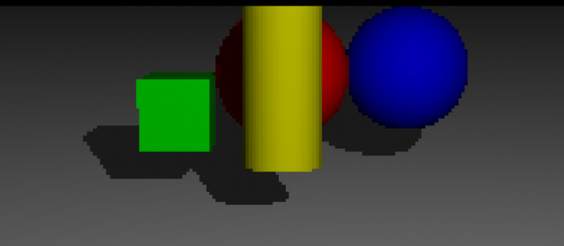

# Projekt POV-RAY 2023, RMS, Informatyka obrazu
### Paweł Habrzyk

## Wstęp do Pov-Ray

Pov-Ray (Persistence of Vision Raytracer) to narzędzie do renderowania grafiki 3D, które używa języka opisu sceny do generowania obrazów z opisów 3D. W tym dokumentacji skupimy się na prostym przykładzie sceny Pov-Ray.

## Podstawy Pov-Ray

### Camera

Definiuje, skąd widz patrzy na scenę. Ma dwa podstawowe parametry:

- `location`: Gdzie kamera jest fizycznie umieszczona.
- `look_at`: Gdzie kamera jest skierowana.
```
camera {
  location <0, 2, -10>
  look_at <0, 0, 0>
}
```
### Light Source

Definiuje źródło światła na scenie. Podstawowe parametry to:

- Pozycja: Gdzie światło jest umieszczone.
- Kolor: Kolor światła.
```
light_source {
  <2, 4, -10>
  color rgb <1, 1, 1>
}
```
### Sphere

Definiuje sferę. Parametry to:

- Pozycja: Gdzie centrum sfery jest umieszczone.
- Promień: Rozmiar sfery.
- Kolor: Kolor sfery.
```
sphere {
  <0, 1, 2>, 1
  texture {
    pigment { color rgb <1, 0, 0> }
  }
}
```
### Box

Definiuje pudełko (3D "kwadrat"). Parametry to:

- Min corner: Najniższy, najbardziej w lewo i najbliżej kamery punkt pudełka.
- Max corner: Najwyższy, najbardziej w prawo i najdalej od kamery punkt pudełka.
- Kolor: Kolor pudełka.
```
box {
  < -2, 0, 1>, < -1, 1, 2>
  texture {
    pigment { color rgb <0, 1, 0> }
  }
}
```
### Cylinder

Definiuje cylinder. Parametry to:

- Base: Dolna część cylindra.
- Cap: Górna część cylindra.
- Radius: Promień cylindra.
- Kolor: Kolor cylindra.
```
cylinder {
  <0, 0, 0>, <0, 2, 0>, 0.5
  texture {
    pigment { color rgb <1, 1, 0> }
  }
}
```
### Plane

Definiuje płaszczyznę. Parametry to:

- Normal: Kierunek, w którym płaszczyzna jest skierowana.
- Distance: Jak daleko od początku układu współrzędnych (0, 0, 0) znajduje się płaszczyzna.
- Kolor: Kolor płaszczyzny.
```
plane {
  <0, 1, 0>, -1
  texture {
    pigment { color rgb <1, 1, 1> }
  }
}
```

## Wyrenderowana scena




